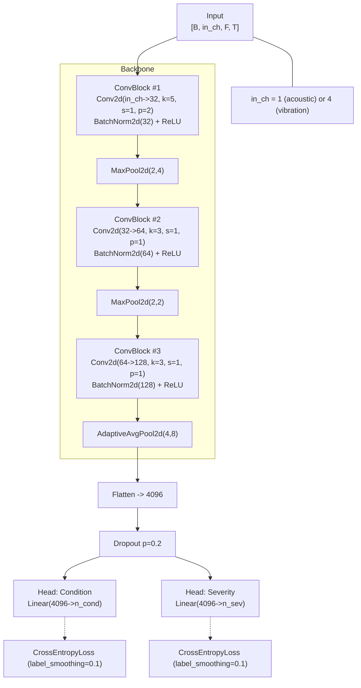

# How to run
### Note: the models are already trained and stored in models/ so you can directly run main.py
1. Download [Vibration, Acoustic, Temperature, and Motor Current Dataset of Rotating Machine Under Varying Load Conditions for Fault Diagnosis](https://data.mendeley.com/datasets/ztmf3m7h5x/6) and extract it in your local machine
2. Extract acoustic, current,temp and vibration
3. clone this repo and add the extracted folders in the repo (same dir as main.py)
4. create venv and install requirements
5. run mat_read.m in matlab (if you don't have matlab give mat_read.m to chatgpt and ask it to make it a python code)
6. run tdms_read.py and tdms_read1.py
7. this adds csv files to acoustic/ and vibration/ and creates a folder called current_temp/ with converted tdms to csv
8. python preprocess.py (this will take a long time, applies cwt on the acoustic and vibration data and saves them as morlet scalograms (.png and .npy) to train the models on)
8. Optional - run compare_models.ipynb and analyse_samplingrate.py to better understand the data and the methods we used
9. python train_cnn.py --cuda --amp --batch-size 16 --rounds 5 --clients-per-round 5 --fl-col-stride 16 --fl-time-crop 512 --fl-freq-end 128 --full-col-stride 8 --full-tile-len 1024 --full-tile-overlap 256 --full-ft-epochs 2  
(I have given some default args to prevent memory overflow while still training on most of the data)
10. Optional - python test_cnn.py
11. python main.py to run the final gradio app
12. Input acoustic and vibration sensor csv data in the app to predict condition (error or normal) and severity (how severe the error is, if any)

### System architecture:
### Model architecture:

<b>See project_understanding.docx to better understand the project<b>